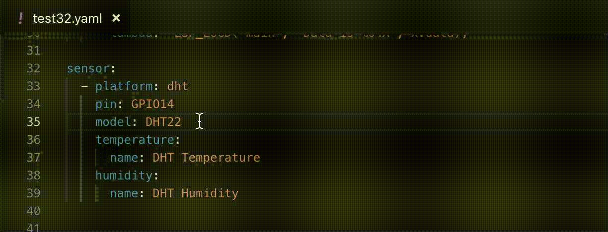

# ESPHome VSCode plugin

This is a (experimental) plugin for providing live validation of ESPHome configuration files with VSCode.



## Configuration and usage

The plugin validates against ESPHome itself, so you will get the same errors. In order for that to work the plugin offers two options:

1. Use the **ESPHome Dashboard**, this can be the ESPHome running in Hass.io, in that case you will need to configure the add on to 'leave the front door open' and also give a tcp port in the addon for external access (in case you are only accessing via Ingress).

2. Use a **local installation of ESPHome**, if you can run esphome in your terminal, then you can use this option.

To select an option use VSCode built in settings editor and search for `ESPHome`. As this extension is under development for changes of these options to take effect you will have to reload VSCode window. If it doesn't seem to work try to reload VSCode window again.

### Feedback

Please submit your issues to https://github.com/esphome/esphome-vscode/issues

## Contributing

> Below is original readme written by @OttoWinter and is inteded for contributing to the development of this plugin, of course contributions are welcome.

In the current state, *it is not supposed to be used for anything more than testing*. The reason for open-sourcing this plugin in this state is that the developer (@OttoWinter) does not know VSCode nor typescript at all.

The hope is that a contributor who knows these systems better can pick it up to get it in a more usable state :) ESPHome would certainly gain a lot of improved UX from the work.

So therefore this document is primarily to document how to set up your dev environment and a description of the protocol.

## Overview

This plugin provides VSCode with diagnostic information via the [programmatic language features API](https://code.visualstudio.com/api/language-extensions/programmatic-language-features#provide-diagnostics). All the validation etc is handled by ESPHome, the plugin just needs to transfer the necessary data to ESPHome and call VSCode's APIs to display the diagnostics.

The interaction between VSCode and ESPHome is done via the ESPHome dashboard with a WebSocket interface. The only URL that needs to be accessed is `ws://<IP_ADDRESS>:6052/vscode` - all communication between VSCode and ESPHome will happen through there.

Each time the websocket is opened, the *dashboard* will spawn a new esphome process (`esphome --dashboard -q dummy.yaml vscode`). The client uses the stdin/stdout of the process to communicate message frames. The dashboard has three types of websocket messages for this (encoded with JSON):

- `"type": "spawn"` - From client to dashboard. Creates the new process. Sent exactly once.
- `"type": "stdin"` - From client to dashboard. Sends data (as a string) to the process.
- `"event": "line"` - From dashboard to client. Each time the process emits a new line on stdout/stderr, a `line` event is sent with the content of the line as a string.

On top of this layer, the process has its own JSON-encoded API that is transmits over stdout and listens on stdin. This protocol is explained in the example below (see also reference implementation src/extension.ts as an example).

## Example

Client (vscode) opens connection to `ws://localhost:6052/vscode`

1. Clients sends spawn message to start the command (later this can contain additional information, for example workspace root) ([`spawn`](https://github.com/esphome/esphome/blob/cleanup-dashboard/esphome/dashboard/dashboard.py#L141), [`/vscode` endpoint](https://github.com/esphome/esphome/blob/cleanup-dashboard/esphome/dashboard/dashboard.py#L244))

```
{"type": "spawn"}
```

2. ESPHome process is started and listening on stdin for data ([source](https://github.com/esphome/esphome/blob/cleanup-dashboard/esphome/vscode.py#L70)). Currently, no message is sent to acknowledge this, if necessary, I can add it in the backend.

3. The clients sends a `stdin` command and transfers a `validate` command to the process.

```
# Message data:
{"type":"validate","file":"config/test32.yaml"}
# Resulting stdin message (from VSCode to dashboard)
{"type":"stdin","data":"{\"type\":\"validate\",\"file\":\"config/test32.yaml\"}\n"}
```

4. The esphome process will attempt to validate the configuration ([source](https://github.com/esphome/esphome/blob/cleanup-dashboard/esphome/vscode.py#L76)). Each time it sees a file that needs to be read, a `read_file` query is posted to stdout ([source](https://github.com/esphome/esphome/blob/cleanup-dashboard/esphome/config_helpers.py#L16)) and transmitted via a `line` event ([source](https://github.com/esphome/esphome/blob/cleanup-dashboard/esphome/dashboard/dashboard.py#L184)):

```
# Message data:
{"type":"read_file","path":"config/test32.yaml"}
# Resulting websocket message (from dashboard to VSCode)
{"event":"line","data":"{\"type\":\"read_file\",\"path\":\"config/test32.yaml\"}\n"}
```

(the path given in `path` will be based on the path passed in in `validate`. So if an absolute path is passed in the validate command, the read_file query will also request an absolute path.)

5. The client opens the requested file and returns the contents of the file with a `file_response` type message ([source](https://github.com/esphome/esphome/blob/cleanup-dashboard/esphome/config_helpers.py#L19)).

```
# Message data:
{"type":"file_response","content":"..."}
# Resulting websocket message (from VSCode to dashboard)
{"type":"stdin","data":"{\"type\":\"file_response\",\"content\":\"...\"}\n"}
```

6. Steps 4-5 are repeated until all files that need to be read are finished (for example `!include` or `!secret` can lead to other `read_file` queries).

6. When done, the process emits a `type: result` message on stdout with the result of the validation ([source](https://github.com/esphome/esphome/blob/cleanup-dashboard/esphome/vscode.py#L84)).

```
# Example valid result:
{"type":"result","yaml_errors":[],"validation_errors":[]}
# Websocket message
{"event":"line","data":"{\"type\":\"result\",\"yaml_errors\":[],\"validation_errors\":[]}\n"}

# Example result with YAML errors (pretty printed)
# (error message is taken directly from PyYAML exception,
# so position in file as int is unknown/would need to be parsed)
{
    "type":"result",
    "yaml_errors": [{
        "message": "Invalid block comment at (some position)"
    }],
    "validation_errors": []
}

# Example result with validation error (pretty printed)
# Note: range parameter can also be null if the position cannot be infered
# from the validation error
{
    "type":"result",
    "yaml_errors": [],
    "validation_errors": [{
        "message": "Unknown value 'DHT42', did you mean 'DHT22', 'DHT11'?",
        "range": {
            "document": "config/test32.yaml",
            "start_line": 28,
            "start_col": 35,
            "end_line": 28,
            "end_col": 38
        }
    }]
}

# start_line, start_col, etc are all zero-based (like VSCode expects it)
```

7. The process and websocket connection are kept open and everything from step 3 can be repeated.

## Reason for using stdin/stdout

You might think using the dashboard to spawn a new process and communicating over stdin/stdout is kind of ugly - and yes it is. But it was way easier to set it up this way than to create an entirely new communication layer. Also, spawning the validation in a new process has the added benefit that in case the validation screws up the internal state of the application, the dashboard will be unaffected (because it's in a separate process).

## Reason for keeping connection open

The websocket connection and esphome process are kept open after a validation result (see step 7 in example). This is in order to improve performance. The python VM can take a while to spin up and load all imports, but after that it's reasonably fast. Keeping the process open means that the VM doesn't need to be restarted for each validation and speeds everything up greatly.

## Problems that will need to be tackled

- The reference implementation is not thread safe. For example when triggering a validation very quickly another, a `validate` command will be sent while the process is waiting for a `read_file`. -> The extension will need some way of "not triggering a validation while another one is running".

- The WS url is currently hard-coded and set to `ws://localhost:6052/vscode`. There will need to be some way of specifying it over a dialog/configuration option.

- Authentication also will need to be resolved. The dashboard uses a "secure cookie" for this that is set when the client first logs in (at `/login`). The plugin will need some way of setting this cookie (or another authentication mechanism needs to be added in the backend).

- The validation is fast enough to be triggered on every document change (`onDidChangeTextDocument`).  However, while the user is editing a file the YAML will of course be malformed, we would need to add some sort of debounce for displaying errors probably.

- `!include`s - There needs to be some way for the user to specify which file to validate. For example, if the user is `!include`ing a file, the validate command needs to be created against the "root" YAML file, not the currently open one.

- Error handling like websocket connection lost.

**Need any changes in the backend or some protocol changes? I can implement that when necessary no problem! Use [this issue](https://github.com/esphome/esphome-vscode/issues/1) to discuss changes and coordinate efforts.**

## Future work

The focus right now should be on getting validation ready. There are many things that we could explore
to make using esphome even better:

- Provide in-line documentation links/view with hover cards.
- Show quick fixes for diagnostics.
- Show snippets while editing.
- Potentially: Migrate to "language server protocol".

## Setting up dev environment

To set up a dev environment:

```bash
git clone https://github.com/esphome/esphome
cd esphome
git checkout cleanup-dashboard
script/setup
mkdir -p config
esphome config/ dashboard

# In another window
git clone https://github.com/esphome/esphome-vscode
cd esphome-vscode
npm install
code .
# The usual vscode editing process, launch with F5
```

In the VSCode extension preview window, open an ESPHome YAML file, make some changes and save. You should see some messages pop up in the extension window and diagnostics have showing up.

(make sure the file doesn't have any includes or secrets, those currently do not work.)

_This is a (very bad) reference implementation, feel free to change the current source completely._
