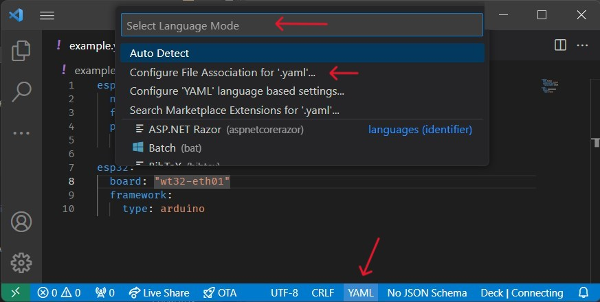

# ESPHome VSCode plugin

This plugin provides validation, completion and hover help for ESPHome Yaml files.

## Configuration and usage

The plugin validates against ESPHome itself, so you will get the same errors. You can connect to ESPHome in two different ways:

1. Use the **ESPHome Dashboard**, this can be the ESPHome running in Home Assistant, in that case you will need to configure the add on to 'leave the front door open' and also give a tcp port in the addon for external access (in case you are only accessing via Ingress).

2. Use a **local installation of ESPHome**, if you can run esphome in your terminal, then you can use this option.

To select an option use VSCode built in settings editor and search for `ESPHome`. As this extension is under development for changes of these options to take effect you will have to reload VSCode window. If it doesn't seem to work try to reload VSCode window again.

Completion and hover help works with local data in the extension, so you will get this functionality even if the
connection with ESPHome is not made.

### Selecting the ESPHome language

The Plugin creates a new [language](https://code.visualstudio.com/docs/languages/overview) type of `ESPHome` that can be associated with `.yaml` or `.yml` filetypes. To enable the plugin's features for a file, that file must be associated with the `ESPHome` language.

Whilst you have an ESPHome configuration file open you can do *one* of the following:

* type `Ctrl`+`K` followed by `M`;
* type `Ctrl`+`Shift`+`P` to open the command pallette, and search for `Change Language Mode`, followed by enter;
* click the current language in the footer (see the bottom arrow in the image below);

to bring up the below menu:

From here you can search for, and select the `ESPHome` language.  Or you can configure all such extensions to be associated with the `ESPHome` language (which is not recommended unless you exclusively use YAML files with ESPHome), by selecting the `Configure File Association for '.yaml'...` option prior to selecting the language.

### Feedback

Please submit your issues to https://github.com/esphome/esphome-vscode/issues

## Contributing

For contributing check CONTRIBUTING.md
