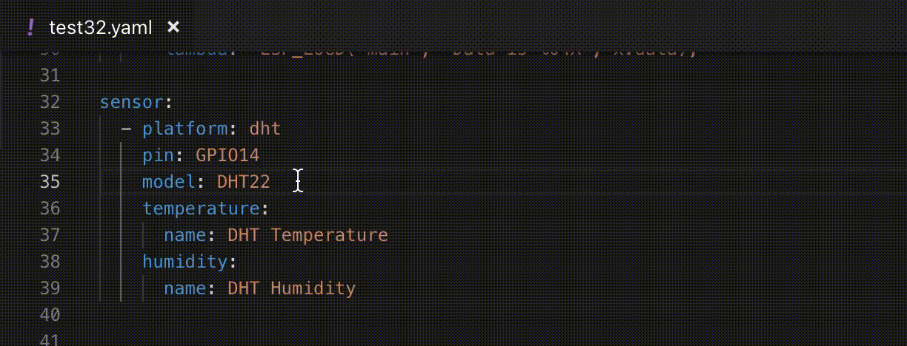
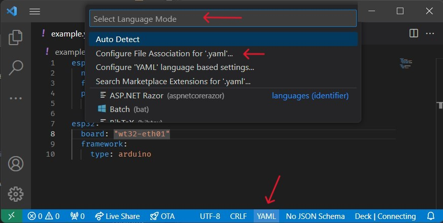

# ESPHome VSCode plugin

This plugin provides validation, completion and hover help for ESPHome Yaml files.

## Configuration and usage

The plugin validates against ESPHome itself, so you will get the same errors. You can connect to ESPHome in two different ways:

1. Use the **ESPHome Dashboard**, this can be the ESPHome running in Home Assistant, in that case you will need to configure the add on to `leave_front_door_open` and also give a tcp port in the addon for external access (in case you are only accessing via Ingress).

2. Use a **local installation of ESPHome**, if you can run esphome in your terminal, then you can use this option.
   If you have installed esphome in a virtual environment, then make sure you also have the Python extension in vscode. This will allow you to select the Python
   interpreter, this is the python executable inside your venv folder. Once you do this you should be able to run esphome command from the integrated terminal.
   Also the extension will pick up the venv folder and run esphome from there.
   If this does not work the fallback option it to have esphome in your global path, i.e. if you can run esphome in a regular terminal without loading a venv
   the extension will work with this.

To select an option use VSCode built in settings editor and search for `ESPHome`. Changing this settings requires reload of the extension.

Completion and hover help needs to pull schema from https://schema.esphome.io. The schemas are versioned so the extension will first connect to you dashboard or local
ESPHome to retrieve the version you are using and then try to pull the best available matching version.
For the dev version it will pull the schemas dev version daily.

### Selecting the ESPHome language

The Plugin creates a new [language](https://code.visualstudio.com/docs/languages/overview) type of `ESPHome` that can be associated with `.yaml` or `.yml` filetypes. To enable the plugin's features for a file, that file must be associated with the `ESPHome` language.

Whilst you have an ESPHome configuration file open you can do _one_ of the following:

- type `Ctrl`+`K` followed by `M`;
- type `Ctrl`+`Shift`+`P` to open the command pallette, and search for `Change Language Mode`, followed by enter;
- click the current language in the footer (see the bottom arrow in the image below);

to bring up the below menu:

From here you can search for, and select the `ESPHome` language. Or you can configure all such extensions to be associated with the `ESPHome` language (which is not recommended unless you exclusively use YAML files with ESPHome), by selecting the `Configure File Association for '.yaml'...` option prior to selecting the language.

### Feedback

Please submit your issues to https://github.com/esphome/esphome-vscode/issues

## Contributing

For contributing check CONTRIBUTING.md
